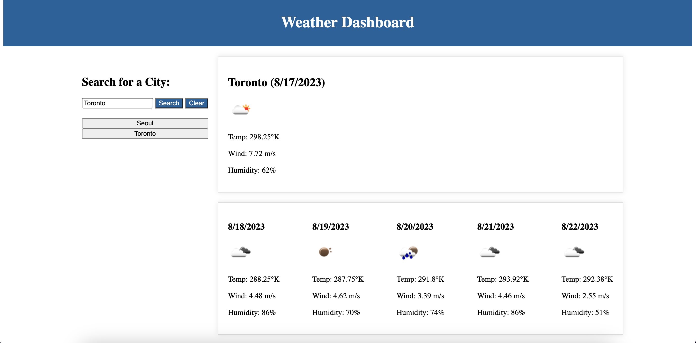

# Weather-Dashboard

This is an app that enables users to view the current weather and the 5-day forecast of a chosen city.

## Link to Deployed Application
<a href="https://yega1009.github.io/Weather-Dashboard/">Weather Dashboard</a>

## Description
- This web application is designed to provide current weather conditions and a 5-day forecast for a chosen city by the user.
- The application fetches data from the OpenWeatherMap API and presents it to the user.  
- The dashboard consists of weather description such as weather icons, temperature, wind speed, and humidity. 
- It also allows users to revisit their recent searches.

## Installation

N/A

## Usage
- Users can enter the city name in the input field, click the "Search" button, and the current weather 
for the selected city will show on the right, along with a 5-day forecast below it.
- Users can view recent search history by clicking on the city name form the list of cities they previously searched for.
- Users can view the weather icon that represents the current condition, temperature, wind speed, and humidity of the city.

## Screenshot of the Website

## Credits

N/A

## License

Please refer to the LICENSE in the repo.
